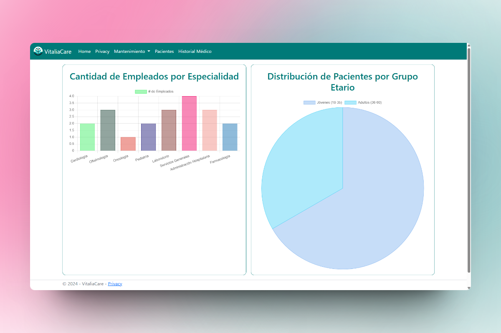
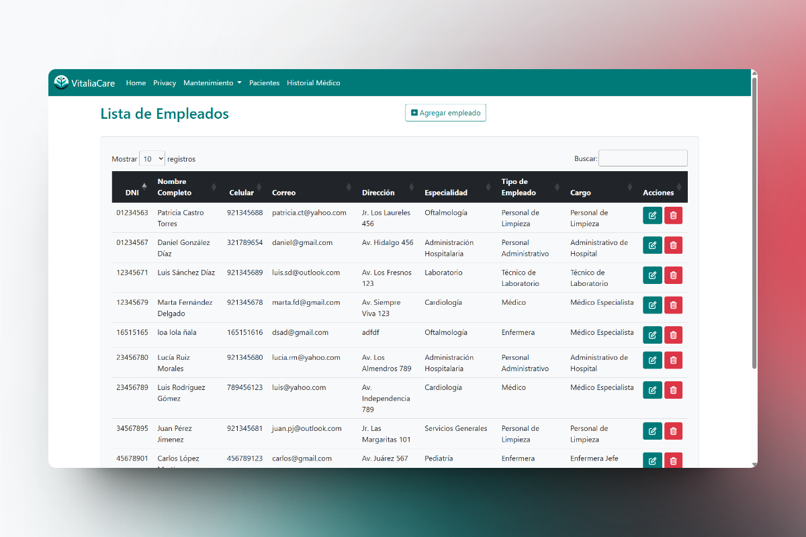
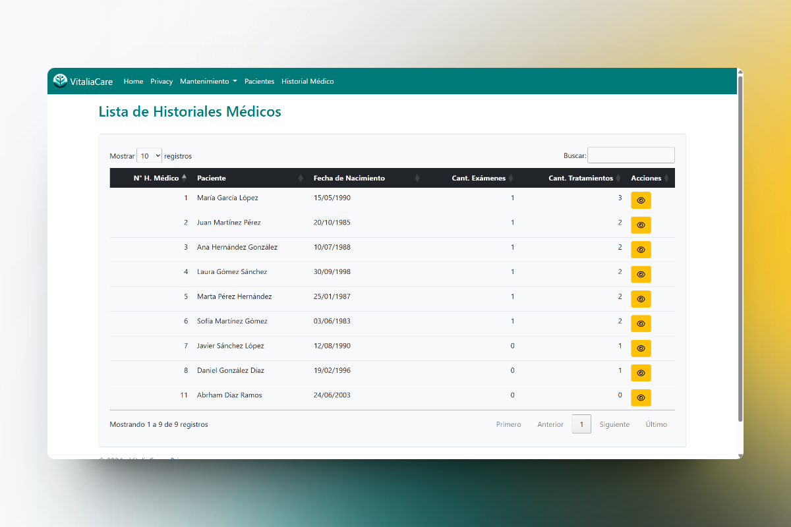
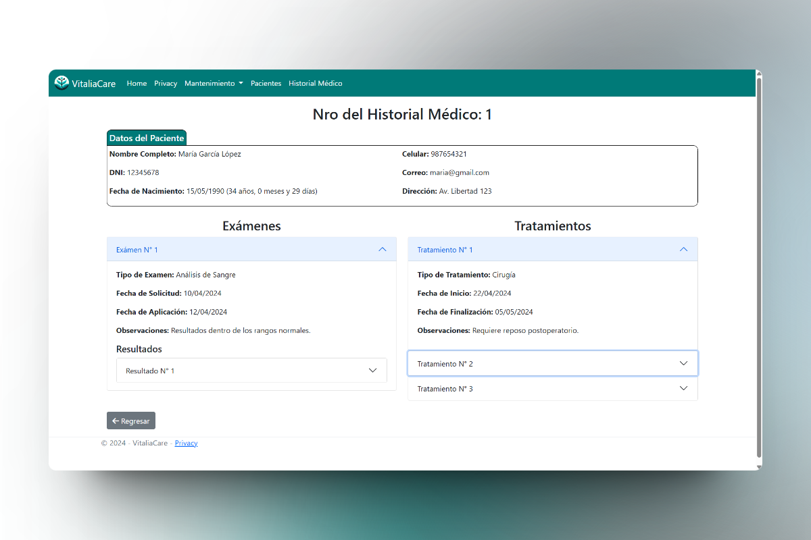
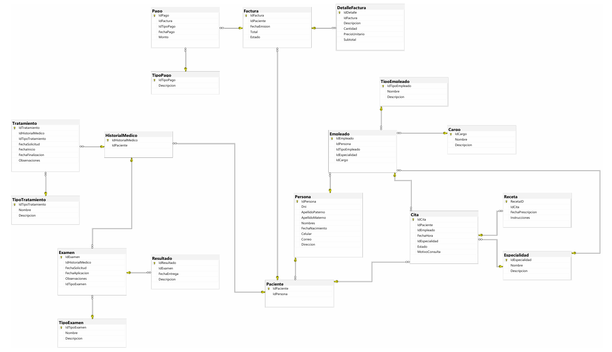

# Proyecto Sistema Hospital

VitaliaCare es un sistema web en desarrollo para un hospital.

## Descripción

Este proyecto es un sistema web diseñado para gestionar las operaciones y datos de un hospital. Incluye funcionalidades para manejar pacientes, médicos, citas y otros aspectos administrativos.

## Tecnologías Utilizadas

- **C#**
- **HTML**
- **JavaScript**
- **CSS**
- **Bootstrap**
- **ASP.NET**
- **Entity Framework (Database-First)**

## Estructura del Proyecto

- **SistemaHospital**: Contiene el código fuente del proyecto.
- **SistemaHospital.sln**: Archivo de solución para Visual Studio.

## Requisitos

- Visual Studio 2022 o superior
- .NET 6

## Instalación

1. Clona este repositorio: 
   ```bash
   git clone https://github.com/Paul-06/Proyecto-Sistema-Hospital.git
   ```
2. Abre la solución `SistemaHospital.sln` con Visual Studio.
3. Compila y ejecuta el proyecto.

Nota: Si prefieres usar VS Code, puedes abrir el proyecto con él y se ejecutará automáticamente.

## Capturas del Sistema

### Pantalla de Inicio


### Pantalla de Mantenimiento de Empleados


### Pantalla de Historiales Médicos


### Pantalla de Detalle de Historial Médico


### Estructura de la Base de Datos


## Contribuciones

¡Las contribuciones son bienvenidas! Siéntete libre de abrir un issue o enviar un pull request.
